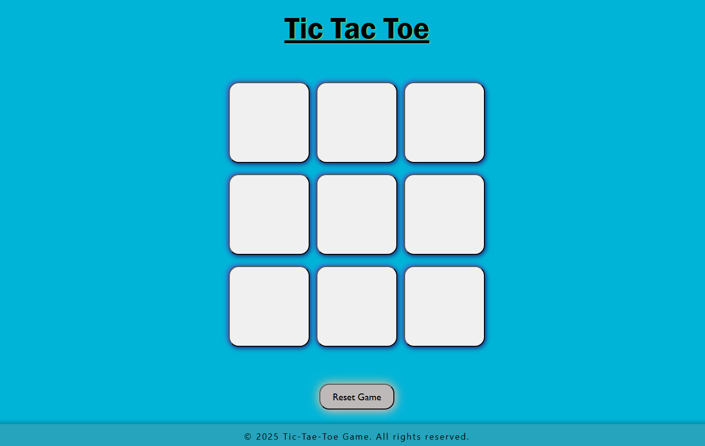

# Tic-Tac-toe
Tic Tac Toe is a simple, fun, and classic two-player game implemented as a programming project. The game is played on a 3x3 grid where two players take turns marking the spaces with "X" and "O". The goal is to be the first player to get three of your marks in a row (vertically, horizontally, or diagonally).

This project is a great way to understand and practice basic programming concepts such as loops, conditionals, functions, arrays, and user input handling.

